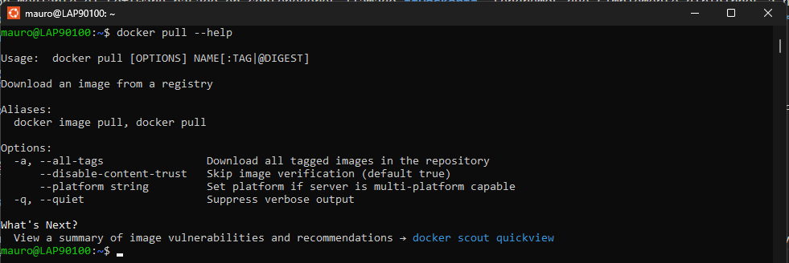
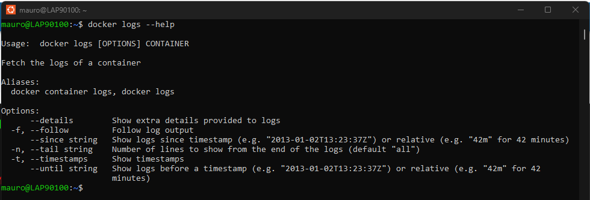
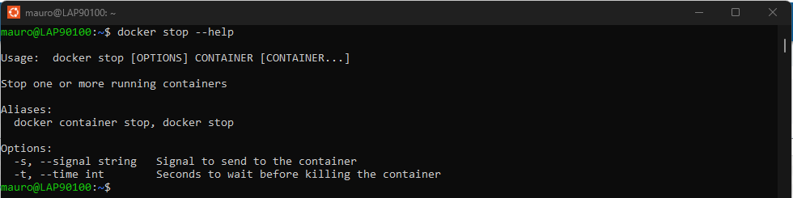
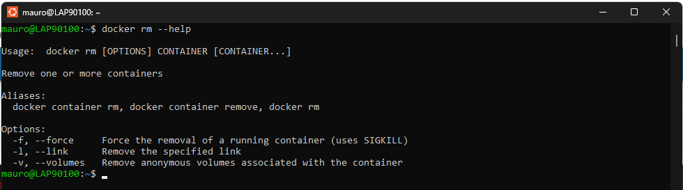
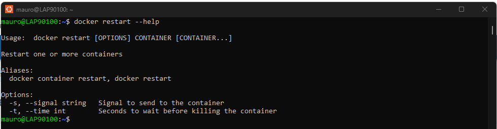

## Practica 3.1 Mis primeros pasos con Docker (PARTE I)

# Docker instalado correctamente

**Nombre de usuario**: eltitomauro

# Creacion y ejecución del contenedor (hello-world)

Para poder crear un contenedor mediante el software basado en contenedores llamado **Docker**, tendremos que simplemente dirigirnos a nuestra consola de comando de nuestra sistema mediante la cual trabajamos con docker, en mi caso, uso el subsistema de Linux **(WSL)**, lo abrimos y ejecutamos el comando **"docker run nombrecontenedor"**, donde el nombre del contenedor es **"hello-world"**.

Por tanto, al haber ejecutado dicho comando para poder crear el contenedor dentro de docker, si nos dirigimos a docker podemos ver perfectamente que se ha creado correctamente el contenedor.

# Principales comandos usados en docker:

- **pull**: Es un comando usado para poder descargar desde el repositorio de una imagen con una versión concreta indicada o la última versión. La sintáxis de este comando consiste en: **docker pull **

Algunas de las opciones que nos ofrece este comando son las siguientes:

  - **-a**: Para poder descargar todas las etiquetas posibles que se encuentren disponibles de una imagen en concreto.
  
  - **-q**: Esta opción es usada para pode suprimir la salida detallada del comando.

- **run**: Este comando nos permite poder ejecutar un contenedor a partir de una imagen. La sintáxis de este comando trata de la siguiente manera: **docker run [opciones] imagen [comando] [argumentos...]**.

Dicho comando ofrece las siguientes opciones:
    
  - **-d**: Para ejecutar el contenedor en segundo plano.
  
  - **-e**: Establece variables de entorno en la ejecución del contenedor.
  
  - **-h**: Para indicar un nombre de red para el contenedor.
  
  - **--help**: Se obtiene ayuda de todas las opciones que nos ofrece Docker.
  
  - **-i**: Mantiene la STDIN abierta en el contenedor.
  
  - **-ip**: Para asignarle una ip en concreto al contenedor.
  
  - **--restart**: Para poder reiniciar un contenedor en el momento en el cual se caiga por cualquier motivo.
  
  - **--rm**: Esta opción destruye el contenedor al ser parado.

  - **-it**: Crea un terminal interactivo dentro del contenedor.
  
  - **--name**: Establece un nombre al contenedor.
  
  - **-v**: Para poder montar entre el sistema host y el propio contenendor.
  
  - **--net**: Indica la red en la cual se ejecutará el contenedor.
  
  - **-p**: Publica los puertos del contenedor en el host.
  
  - **-t**: Para que el contenedor que vamos a ejecutar nos permita un acceso a un terminal para poder ejecutar órdenes en él.
  
  - **-u**: Establece el usuario con el que va ha ser ejecutado el contenedor.
  
  - **-v**: Para poder montar un volumen o un bind mount en el contenedor.
  
  - **-w**: Establece el directorio de trabajo en un contenedor.

- **start**: Este comando nos permite poder arrancar/iniciar un contenedor en concreto **(ya sea indicandole el nombre o el ID)** una vez que haya sido previamente detenido. La sintáxis de este comando consiste en: **docker start [opciones] contenedor [contenedor..]**

Estas son algunas de las opciones que nos ofrece:
  
  - **-it**: Es una opción que nos permite que la opcion que vayamos a ejecutar seguida del comando run nos permite hacerlo el comando en gran medida lo haga lo más configurable posible. En este caso se hace uso de la opción "**-it**", la cual nos permite poder ejecutar un contenedor que no tiene servicios. Lo que conlleva este flag es la unión de dos opciones en una: **-i (--interactive)** y **-t (--tty)**. Por lo que en este caso se esta ejecutando dos acciones al mismo tiempo con una simple union de dos opciones concretamente: Abrir la entrada estándar del contenedor que estamos ejecutando y permitir la posibilidad de abrir un terminal en el contenedor.
  
  - **-d**: Es un flag usado para poder ejecutar un servicio de un contenedor en modo "**background o dettach**". En caso de que no haya sido ejecutado dicho flag se bloqueará la terminal mostrando el log del servicio.
  
  - **-p**: Es la flag usada para el caso de que queramos que el servicio que vayamos a lanzar sea accesible de forma externa. Para ello, se tendria que especificar de la siguiente manera: **docker run -p PUERTO_EN_HOST:PUERTO_EN_CONTENEDOR**. Esto consiste en una **Redirección de puertos**.
  
  - **--name**: Flag usada concretamente para asignar/indicar un nombre al contenedor que va ha ser ejecutado.

- **exec**: Este comando es usado para poder ejecutar un comando dentro de un contenedor creado en Docker el cual se encuentra en ejecución. Las operaciones más comunes que nos permite llevar a cabo este comando son las siguientes:
  
  - **Instalación de paquetes**
  - **Modificación o visualización del contenido de ciertos ficheros**
  - **Activación de ciertos módulos de servicios**:

La sintáxis de este comando consiste en: **Docker exec [opciones] nombre_contenedor orden [argumentos]**

Las opciones más importantes que tiene este comando son las siguientes:
  
  - **-d**: Ejecuta el comando en segundo plano.
  
  - **-t**: Asigna un terminal pseudo-TTY al comando, lo que permite la interacción con él.
  
  - **-u**: Especifica el usuario bajo el cual se ejecutará el comando que sea diferente al **root**.
  
  - **-w**: Establece el directorio de trabajo dentro del contenedor antes de ejecutar el comando.
  
  - **-it**: Esta flag une dos mismas opciones **(-i y -t)** para poder llevar a cabo al mismo tiempo dos acciones: Tener interactividad con el contenedor ejecutando un shell.

Una de las órdenes más usadas de este comando una vez que nos encontremos trabajando dentro del contenedor es la de **"cp"**, que nos permitirá poder mover ficheros desde mi sistema al contenedor y desde el contenedor a mi sistema.

- **ps**: Sirve para obtener información de los contenedores que se encuentran en ejecución, esta es la sintáxis del comando: **docker ps [opciones]**

Indica información acerca de los siguientes aspectos:
  
  - **Estado del contenedor**: Parado **(EXITED)** o funcionando (**UP**).
  - **Imagen de la que deriva el contenedor.**
  - **Tamaño actual del contenedor.**
  - **ENTRYPOINT**: Es la orden que ejecuta el contenedor al arrancar.
  - **Nombre del contenedor.**
  - **Cuando fue creado el contendor**
  - **Redirecciones de puertos**

Estas son algunas de las opciones más usudas que nos proporciona este comando:

  - **-a**: Muestra una salida de todos los contenedores, ya estén parados o en ejecución.
  
  - **-s**: Nos ofrece información acerca del tamaño del contenedor a la información por defecto.
  
  - **-l**: Nos proporciona información acerca del último contenedor que ha sido creado.
  
  - **-f**: Esta opción nos permite poder filtrar contenedor mediante criterios/condiciones que se le indiquen dentro de la propia sintáxis **(docker ps -f filter)**, este es un ejemplo:
    
    - **docker ps -f name=contenedor1**: En este ejemplo, estamos filtrando la busqueda de contenedores para que docker nos pueda mostrar el contenedor que tenga asignado/establecido el nombre contenedor1 como se ha indicado dentro de la sintáxis del comando.
    
    - **docker ps -f publish=443**: En este caso, estariamos filtrando la busqueda de contenedores para que docker nos muestre todos aquellos contenedores que hacen público un puerto en concreto, en este caso el puerto **443**.

- **inspect**: Nos ofrece información acerca de los contenedores de una forma más detallada. La sintaxís de este comando se basa en: **docker inspect [opciones] nombre|ID [nombre|ID..]**.

Estas son las opciones explicadas detalladamente que tiene este comando:

  - **-f**: Para poder formatear la salida del comando, esta opción es util en ciertos casos como son en los siguientes:
  
    - **docker inspect --f 'La ip es {{.NetworkSettings.Networks.bridge.IPAddress}}' nombre_contenedor**: En este caso estariamos mostrando la dirección IP que tiene asignada el contenedor que hemos indicado dentro de la sintáxis del comando.
    
    - **docker inspect --format 'Las redirecciones de puertos son {{.NetworkSettings.Ports}}' nombre_contenedor**: En este ejemplo, estamos mostrando las redirecciones de puertos posibles que tiene el contenedor en concreto que hemos indicado.

La información que nos muestra la salida de dicho comando es la siguiente:

  - **ID del contenedor**: Que es el identificador que identifica de forma única a un contenedor.
  - **Puertos abiertos y sus redirecciones**
  - **Binds mounts y volúmenes usados**
  - **Tamaño del contenedor**
  - **Configuración de red del contenedor**
  - **ENTRYPOINT que es lo que ha sido ejecutado al haber ejecutado un docker run**
  - **El valor de las variables de entorno**

- **logs:** Es usado para poder ver y recuperar los registros que han sido generados por parte de un contenedor en concreto que se puede encontrar en ejecución o parado. La sintáxis de dicho comando es la siguiente: **docker logs [opciones] contenedor**.

Puede ser usado de dos formas para poder localizar logs/registros de un contenedor en concreto:

  - Indicándole el nombre del contenedor: **docker logs nombre_contendor**
  
  - Indicándole el ID del contenedor: **docker logs 5e5adf6815bc**

Estas son algunas de las opciones que nos ofrece este comando:

  - **-f**: Para que en la salida del comando podamos mediante esta opción poder estar a la escucha de los posibles logs que nos pueda generar el contenedor.
  
  - **--tail**: Esta opción nos muestra un número determinado de líneas que le especifiquemos dentro de la sintáxis del comando, para de esa manera poder ver ciertas líneas en concreto de los logs que nos haya ocasionado el contenedor.

- **stop**: Es un comando usado para poder eliminar uno o varios contenedores al mismo tiempo especificándole el nombre del contenedor/es o el ID. La sintáxis de dicho comando consiste en: **docker stop [opciones] contenedor [contenedores...]**.

Estas son las opciones que nos ofrece el comando:

  - **-s**: Mediante esta opción enviar una señal de detención hacia el contenedor. Un caso donde se podría usar es el siguiente:
     
    - **docker stop -s SIGINT hola**: Como podemos fijarnos dentro de la sintáxis del comando, estamos enviando una señal hacia el contenedor que hemos indicado para que se pueda deterner.
    
  - **-t**: Para un contenedor que se encuentra en ejecución indicando un ID o un nombre del contenedor durante un tiempo especificado dentro de la sintáxis. Ejemplo:
  
    - **docker stop -t 33 test**: En este caso, estaríamos parando durante 33 segundos un contenedor que se llama test.

- **rm**: Es usado para eliminar contenedores. Su sintáxis trata de: **docker rm [opciones] contenedor [contenedor..]**

Una de las opciones más común que proporciona el comando son las siguientes:

  - **-f**: Esta opción nos permite el lujo de poder eliminar un contenedor de una forma forzada aunque se encuentre en ejecución.

- **restart**: Es usado para poder reinciar uno o varios contenedores concretos de forma simultánea. La sintáxis del comando es la siguiente: **docker restart [opciones] contenedor [contenedor..]**.

Las opciones que proporciona este comando son las mismas que las del comando **stop**:

- **-s**: Mediante esta opción enviar una señal de detención hacia el contenedor. Un caso donde se podría usar es el siguiente:
     
    - **docker stop -s SIGINT prueba**: Como podemos fijarnos dentro de la sintáxis del comando, estamos enviando una señal hacia el contenedor de reincio que hemos indicado para que se pueda reiniciar.
    
  - **-t**: Reinicia un contenedor que se encuentra en ejecución indicando un ID o un nombre del contenedor durante un tiempo especificado dentro de la sintáxis. Ejemplo:
  
    - **docker stop -t 28 test**: En este caso, estaríamos reinciando durante 28 segundos un contenedor que se llama test.

- 